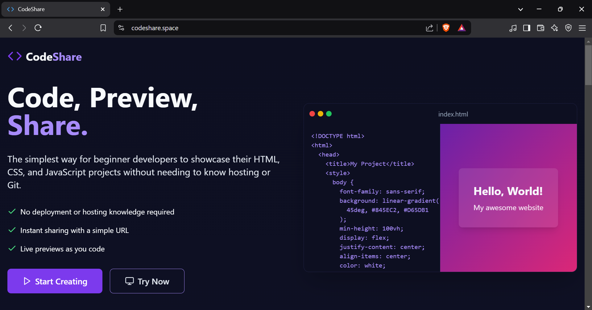

# CodeShare

## 🚀 Instant Code Sharing Made Simple

**CodeShare** is a platform where developers can write, share, and showcase HTML, CSS, and JavaScript code without needing Git repositories or hosting knowledge. Create websites and code snippets instantly and share them with a simple URL.

## ✨ Features

- **Live Code Editor** - Write HTML, CSS, and JavaScript with real-time preview
- **Instant Sharing** - Generate a unique URL with one click to share your creation
- **No Setup Required** - No Git knowledge, no hosting setup, no deployment hassles
- **Responsive Testing** - Preview your creations on different device sizes
- **Code Formatting** - Automatic code beautification and syntax highlighting

## 🔧 How It Works

1. **Create** - Open the editor and start coding in HTML, CSS, and JavaScript
2. **Preview** - See your changes instantly in the live preview panel
3. **Share** - Click "Share" to generate a unique URL
4. **Collaborate** - Send the URL to friends or colleagues to view or collaborate

## 💻 Perfect For

- **Beginners** learning web development without the complexity of Git
- **Teachers** sharing code examples with students
- **Developers** quickly prototyping ideas or demonstrating concepts
- **Interviewers** running coding exercises
- **Teams** collaborating on small web projects

## 📱 Use Cases

- Create and share small web applications
- Build and demonstrate UI components
- Test CSS designs across different devices
- Share interactive code samples in tutorials

## 🔗 Getting Started

Simply visit [codeshare](https://codeshare.space) to start creating.!

## 📋 Upcoming Features

- Code linting and error detection
- Additional language support (SCSS, TypeScript, etc.)
- Embeddable widgets for blogs and documentation
- Team workspaces for collaborative projects
- API for programmatic access

## 🤝 Contributing

We welcome contributions to CodeShare!
---

Built with ❤️ for developers who want to focus on code, not infrastructure.